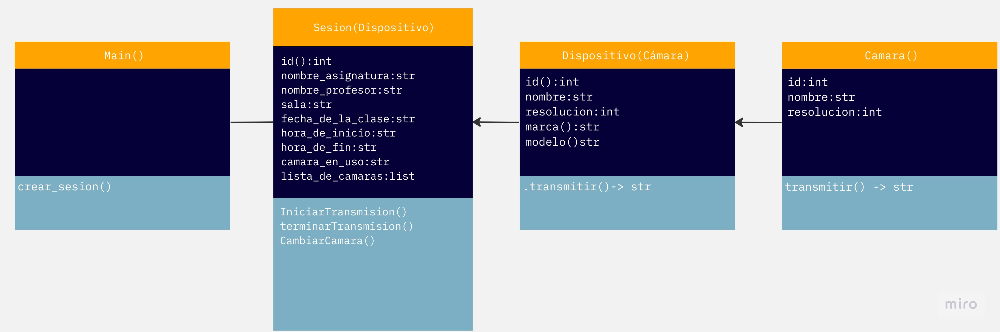

# labaratorio 1

### **Integrantes:** Nicolas Alberto Vega Diaz
### **Profesor:** Joel Sebastian Torres Carrasco 
### **asignatura:** Taller De Programacion Aplicada
---
## Problema.

Crear un módulo de programa, en Java o Python, que permita seleccionar la cámara
que transmitirá la clases:

1. Diseñe la solución en un diagrama de clases considerando las clases camara:
Camara: Corresponde a una clase que tendrá el método transmitir, que permite que la
cámara realice la clase. Los atributos de esta clase son: id, nombre y resolución.

2. Dispositivo: Representa a cada dispositivo con cámara que se utilizarán. Esta clase
hereda de Camara. Los atributos de esta clase son: 
marca y modelo.
---

1. Sesion: Representa a la grabación de una clase. Los atributos son: id, nombre asignatura, nombre profesor, sala, fecha de la clase, hora inicio, hora fin, cámara en uso y
lista de cámaras. Tiene el método de iniciarTransmision, terminarTransmision y cambiarCamara, lo que permite utilizar la cámara del siguiente dispositivo en la lista de
cámaras.
Main: Representa a la clase principal que permite crear diferentes sesiones de clases y
manipular la grabación de las clases.

2.  Desarrolle la clase Camara y el método transmitir.

3.  Desarrolle la clase Dispositivo que herede de la clase Camara, donde el m´etodo
transmitir imprimir´a un String por pantalla con el nombre del dispositivo.

4. Desarrolle la clase Sesion, permitiendo agregar varios objetos de clase Camara.
Considere que el método cambiarCamara solamente debe cambiar la cámara del atributo
camaraEnUso con otra de las cámaras en la lista.

5.  Desarrolle la clase Main, creando un menú simple que permita al usuario crear una
sesión de clase con las cámaras que requiera (al menos 1), y realice cambios de cámara. El
programa debe indicar en todo mometo, a través de un texto por pantalla, cuál es la cámara
en uso.

6. Desarrolle una clase Asistencia para guardar la lista de Estudiantes presentes
en la Sesion grabada. Implemente los atributos y métodos que sean necesarios. 

---
## 
